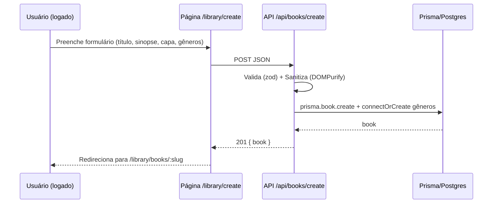
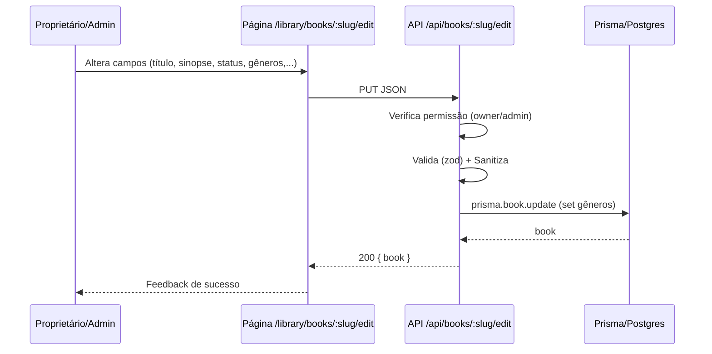
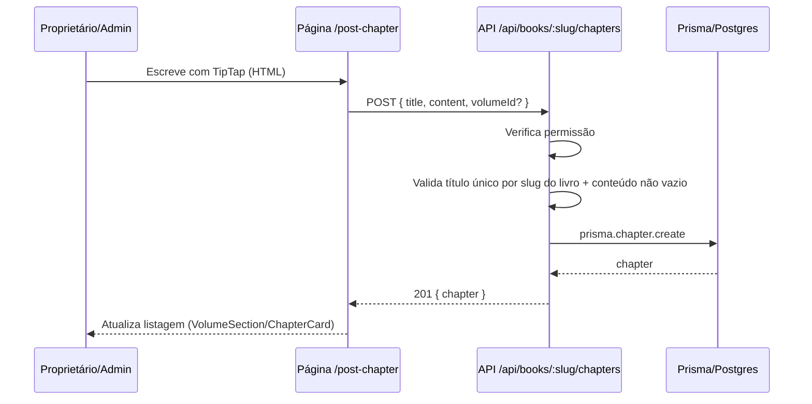
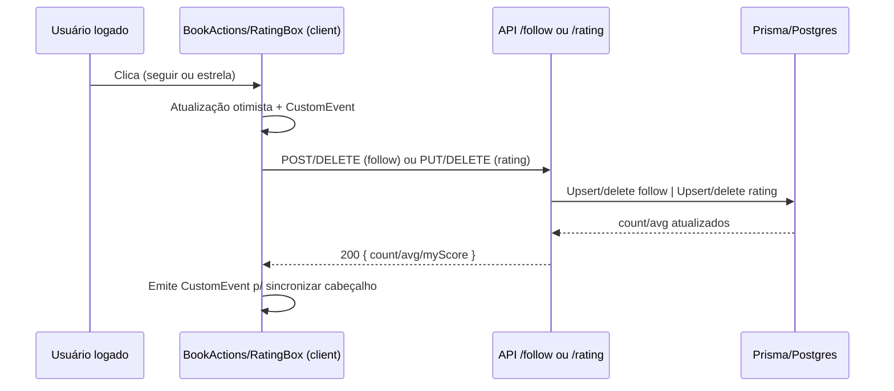

# Guia de Rotas, Estrutura e Fluxos do ReadOwl (Next.js)

Este documento explica, em português, como o projeto ReadOwl em Next.js está organizado: estrutura de pastas, convenções de rotas (App Router), principais páginas e APIs, e o fluxo geral de uso do sistema. O objetivo é orientar o time que vinha no projeto React puro para compreender e evoluir o projeto em Next.js com segurança.

Observação: o README já cobre como subir o projeto. Aqui focamos em arquitetura, rotas e fluxo.

Índice rápido
- [Visão geral do Next.js (App Router)](#visao-geral-do-nextjs-app-router)
- [Estrutura principal de pastas](#estrutura-principal-de-pastas)
- [Fluxo de usuário (alto nível)](#fluxo-de-usuario-alto-nivel)
- [Rotas de páginas (src/app)](#rotas-de-paginas-srcapp)
- [Rotas de API (src/app/api)](#rotas-de-api-srcappapi)
- [Autenticação, Sessão e Segurança](#autenticacao-sessao-e-seguranca)
- [Banco de dados (Prisma/PostgreSQL)](#banco-de-dados-prismapostgresql)
- [Componentes-chave no fluxo de livros](#componentes-chave-no-fluxo-de-livros)
- [Convenções de slug](#convencoes-de-slug)
- [Dicas para expansão/manutenção](#dicas-para-expansaomanutencao)
- [Dependências principais (package.json)](#dependencias-principais-packagejson)
- [Contratos das APIs (src/app/api)](#contratos-das-apis-srcappapi)
- [Mapeamento de Permissões (síntese)](#mapeamento-de-permissoes-sintese)
- [Fluxos com diagramas (Mermaid)](#fluxos-com-diagramas-mermaid)
- [Sanitização: o que é e como aplicamos](#sanitizacao-o-que-e-e-como-aplicamos)
- [middleware.ts: proteção de rotas e política de sessão](#middlewarets-protecao-de-rotas-e-politica-de-sessao)
- [types/*: o que cada arquivo fornece](#types-o-que-cada-arquivo-fornece)
- [lib/*: bibliotecas internas (backend)](#lib-bibliotecas-internas-backend)
- [Guia amigável para estudantes (com referências ao código)](#guia-amigavel-para-estudantes-com-referencias-ao-codigo)
- [O que é Rate Limiting (explicação simples, com referências)](#o-que-e-rate-limiting-explicacao-simples-com-referencias)
- [Comparativo: Next.js (App Router) x React puro (front + back separados)](#comparativo-nextjs-app-router-x-react-puro-front--back-separados)

---

## Visão geral do Next.js (App Router)

- O Next.js (aqui usamos o App Router) define rotas a partir da pasta `src/app`.
- Cada pasta dentro de `src/app` representa uma rota. O arquivo `page.tsx` dentro dela é a página daquela rota.
- Rotas dinâmicas usam colchetes, por exemplo: `src/app/library/books/[slug]/page.tsx` cria a rota `/library/books/:slug`.
- Dentro de cada rota você pode ter sub-rotas (outras pastas), rotas de API (em `src/app/api/...`), e arquivos especiais:
  - `layout.tsx`: layout raiz (envólucro) para toda a aplicação.
  - `not-found.tsx`: página padrão 404.
  - `error.tsx`: boundary de erro de nível de app.
  - `loading.tsx`: (se existir) fallback de carregamento por rota.
- As rotas de API no App Router são arquivos `route.ts` dentro de `src/app/api/...` e exportam handlers como `GET`, `POST`, `PUT`, `DELETE`.

---

## Estrutura principal de pastas

- `src/app/`
  - `layout.tsx`: Layout global (carrega fontes, aplica estilos, provê Providers, navbar/rodapé condicionais).
  - `page.tsx`: Landing principal (`/`).
  - Rotas de alto nível:
    - `/login` — Tela de login.
    - `/register` — Registro de usuário.
    - `/home` — Home autenticada.
    - `/library` — Biblioteca (carrosséis e botões de criação).
    - `/library/create` — Criar livro.
    - `/library/books/[slug]` — Índice de livro (detalhe) por slug.
    - `/library/books/[slug]/edit` — Editar livro por slug.
    - `/library/books/[slug]/post-chapter` — Criar/postar capítulo.
    - `/library/books/[slug]/[chapter]` — Leitura de capítulo por slug amigável.
    - `/library/books/[slug]/[chapter]/edit-chapter` — Editar capítulo.
    - `/forgot-password` — Solicitação de recuperação.
    - `/reset-password` e `/reset-password/success` — Redefinição de senha e confirmação.
    - `/search` — Busca.
    - `/notifications` — Notificações.
    - `/user` — Perfil/área do usuário.
    - `error`, `not-found`, `403` — Tratamento de erros.
- `src/app/api/`
  - Sub-rotas REST do backend Next (SSR):
    - `auth/[...nextauth]/route.ts` — NextAuth (Google e credenciais).
    - `auth/password/request` — Solicita reset (e-mail com token único, TTL 30min, rate-limit IP/usuário).
    - `auth/password/reset` — Confirma reset com token; invalida sessões ao redefinir.
    - `auth/password/who` — Utilitário para identificar usuário do token.
    - `register` — Registro rápido (separado do NextAuth).
    - `books/create` — Criação de livro.
    - `books/[slug]` — GET detalhe por slug (derivado do título) e updates.
    - `books/[slug]/edit` — PATCH/PUT campos do livro.
    - `books/[slug]/follow` — GET status, POST seguir, DELETE deixar de seguir.
    - `books/[slug]/rating` — GET resumo, PUT/DELETE minha avaliação.
    - `books/[slug]/volumes` — GET/POST volumes do livro.
    - `books/[slug]/volumes/[volumeId]` — PUT/DELETE volume específico.
    - `books/[slug]/chapters` — GET/POST capítulos (com ou sem volume).
    - `books/[slug]/chapters/[chapterId]` — PUT/DELETE capítulo.
    - `_dev/test-mail`, `_debug/token` — utilidades internas de dev.
- `src/components/` — Componentes de UI/clinte. Destaques:
  - `components/book/*` — Elementos do índice do livro: cabeçalho, ações (seguir/avaliar), listagem de volumes/capítulos, cartão de capítulo.
  - `components/chapter/*` — Editor de capítulo (TipTap), dropdown de volumes.
  - `components/ui/*` — Breadcrumb, Navbar, Providers etc.
- `src/lib/`
  - `authOptions.ts` — Configuração do NextAuth (Google OAuth, credenciais, callbacks, sessão remember etc.).
  - `mailer.ts`/`emailTemplates.ts` — Envio de e-mails via Nodemailer para reset de senha.
  - `prisma.ts` — Cliente Prisma (PostgreSQL).
  - `rateLimit*.ts` — Limites (IP e usuário) para solicitações sensíveis (ex.: reset).
  - `sanitize.ts` — Sanitização HTML de sinopses; normalização de espaço.
  - `slug.ts` — `slugify()` de títulos para construir slugs de livro.
- `prisma/` — Schema Prisma e migrações (tabelas: Users, Books, Volumes, Chapters, Follows, Ratings etc.).
- `public/` — Ícones, imagens e fontes locais.

---

## Fluxo de usuário (alto nível)

1. Autenticação
   - O usuário pode logar via Google (OAuth) ou por e-mail/senha (credenciais). NextAuth gerencia sessão JWT. O remember (8h vs 30 dias) é mantido por flags na sessão.
   - Reset de senha: `/forgot-password` envia e-mail com token único; `/reset-password` consome o token; há rate-limit por IP e por usuário.

2. Biblioteca e livros
   - `/library` mostra carrosséis com livros (criados, seguidos) e o botão "Criar uma obra”.
   - `/library/create` cria um livro (validações de capa, título/gênero, sinopse sanitizada).
   - `/library/books/[slug]` é o índice do livro: capa com zoom, autor, seguir/deixar de seguir, seguidores, resumo de avaliações, volumes e capítulos (inclui capítulos sem volume), links de leitura e, se for dono, botões de gestão.
   - `/library/books/[slug]/post-chapter` cria capítulos; permite criar volume on-the-fly, mover capítulo entre volumes, etc.
   - `/library/books/[slug]/[chapter]` lê um capítulo (com next/prev e breadcrumb). Se for autor, apresenta ações.
   - `/library/books/[slug]/edit` edita campos do livro (título, sinopse, capa, gêneros, status etc.).

3. Seguir e avaliar
   - Em `/library/books/[slug]`, o usuário pode seguir/desseguir (client-side com hydration para refletir contagem) e avaliar (1–5).
   - A API de rating retorna média e distribuição; o cliente atualiza resumo e contagem via eventos customizados.

---

## Rotas de páginas (src/app)

Abaixo, as páginas principais (as pastas definem as URLs):

- `/` — `src/app/page.tsx`
  - Landing do site; apresenta o projeto e links para login/registro.

- `/login` — `src/app/login/page.tsx`
  - Formulário de login com credenciais e botão “Entrar com Google”. Usa NextAuth.

- `/register` — `src/app/register/page.tsx`
  - Registro básico via API de registro.

- `/home` — `src/app/home/page.tsx`
  - Home autenticada; vitrine para o usuário logado.

- `/library` — `src/app/library/page.tsx`
  - Biblioteca (carrosséis, CTA "Criar uma obra”).
  - Trecho essencial (SSR filtrando pelo usuário):
    ```ts
    const session = await getServerSession(authOptions);
    if (!session?.user) redirect("/login?callbackUrl=/library");
    const myBooks = await prisma.book.findMany({ where: { authorId: session.user.id } });
    ```

- `/library/create` — `src/app/library/create/page.tsx`
  - Criação de livro; validações de capa (proporção), sinopse sanitizada (TipTap + sanitize), seleção de gêneros.

- `/library/books/[slug]` — `src/app/library/books/[slug]/page.tsx`
  - Índice de livro. Busca o livro por slug (derivado do título). Mostra:
    - Cabeçalho do livro (título, autor, seguidores, média de avaliações).
    - Ações: seguir/desseguir; se dono, editar livro, postar capítulo, ordenar/reorganizar capítulos/volumes quando aplicável.
    - Seções de “Volumes” e “Capítulos” (sem volume), com delete/edit. “Começar a ler” pula para o primeiro capítulo.

- `/library/books/[slug]/edit` — `src/app/library/books/[slug]/edit/page.tsx`
  - Edição de livro (capa, título, sinopse, gêneros, status). Submete via API.

- `/library/books/[slug]/post-chapter` — `src/app/library/books/[slug]/post-chapter/page.tsx`
  - Criação de capítulo com TipTap; dropdown de volumes (criar volume inline, renomear, excluir).

- `/library/books/[slug]/[chapter]` — `src/app/library/books/[slug]/[chapter]/page.tsx`
  - Leitura de capítulo. Indica volume (se existir), título, conteúdo e navegação prev/next.

- `/library/books/[slug]/[chapter]/edit-chapter` — `src/app/library/books/[slug]/[chapter]/edit-chapter/page.tsx`
  - Edição de capítulo (mover entre volumes, alterar conteúdo/título, deletar).

- `/forgot-password` — `src/app/forgot-password/page.tsx`
  - Solicitação de reset de senha (validação de e-mail; rate limit; feedback claro).

- `/reset-password` — `src/app/reset-password/page.tsx`
  - Formulário que consome o token recebido por e-mail; verifica regras e redireciona para `/reset-password/success`.

- `/reset-password/success` — `src/app/reset-password/success/page.tsx`
  - Feedback de sucesso após redefinição.

- `/search` — `src/app/search/page.tsx`
  - Página de busca (campos e resultados conforme UX definida).

- `/notifications` — `src/app/notifications/page.tsx`
  - Inbox de notificações.

- `/user` — `src/app/user/page.tsx`
  - Área do usuário (dados básicos e atalhos).

- `error.tsx` e `not-found.tsx`
  - Tratamento genérico para exceções não capturadas e 404.

- `/403` — `src/app/403/page.tsx`
  - Página de acesso negado.

---

## Rotas de API (src/app/api)

Padrão: cada arquivo `route.ts` exporta métodos HTTP.

- `auth/[...nextauth]/route.ts`
  - Configura NextAuth. Suporte a:
    - Google OAuth (credenciais em `.env`/`credentials/google-oauth.json`).
    - Login por credenciais (e-mail/senha) com bcrypt.
  - Callbacks de sessão para remember-me, verificação de `credentialVersion` (invalidação após reset), etc.

- `auth/password/request/route.ts`
  - POST: Enfileira envio de e-mail de reset se usuário existir. Rate-limit 5 req/15min por IP + cooldown por usuário (120s).
  - Trecho essencial (rate limit com Redis/fallback):
    ```ts
    const infoRedis = await rateLimitRedis(req, 'pwd-reset', 15 * 60, 5);
    if (infoRedis && !infoRedis.allowed) {
      return NextResponse.json({ error: 'Too Many Requests' }, { status: 429, headers: rateLimitHeaders(infoRedis) });
    }
    const info = checkRateLimit(req, { windowSec: 15 * 60, limit: 5, key: 'pwd-reset' });
    if (!info.allowed) {
      return NextResponse.json({ error: 'Too Many Requests' }, { status: 429, headers: buildRateLimitHeaders(info) });
    }
    ```

- `auth/password/reset/route.ts`
  - POST: Consome token único (Prisma), redefine senha (bcrypt), atualiza `credentialVersion`, e limpa token.

- `auth/password/who/route.ts`
  - GET: utilidade para inspecionar quem está autenticado (dev/debug).

- `register/route.ts`
  - POST: Registro básico de usuário (nome/e-mail/senha). Pode ser diferente do fluxo de NextAuth.

- `books/create/route.ts`
  - POST: Cria livro; valida campos (título, sinopse sanitizada, capa [proporção, tolerância]).

- `books/[slug]/route.ts`
  - GET: Detalhe por slug.
  - PATCH/PUT conforme implementação para atualizar campos do livro.

- `books/[slug]/edit/route.ts`
  - PUT/PATCH campos relacionados à edição do livro.
  - Trecho essencial (permissão owner/admin + sanitização):
    ```ts
    const isOwner = found.authorId === session.user.id;
    const isAdmin = session.user.role === 'ADMIN';
    if (!isOwner && !isAdmin) return NextResponse.json({ error: 'Forbidden' }, { status: 403 });
    const cleanSynopsis = sanitizeSynopsisHtml(data.synopsis);
    ```

- `books/[slug]/follow/route.ts`
  - GET: status de follow.
  - POST: seguir.
  - DELETE: deixar de seguir.
  - Trecho essencial (usar o id do usuário logado):
    ```ts
    const session = await getServerSession(authOptions);
    const userId = session?.user?.id;
    await prisma.bookFollow.create({ data: { userId, bookId: book.id } });
    ```

- `books/[slug]/rating/route.ts`
  - GET: resumo (média, contagem, distribuição).
  - PUT: define/atualiza minha avaliação.
  - DELETE: remove minha avaliação.
  - Trecho essencial (upsert e retorno do meu score):
    ```ts
    await prisma.bookRating.upsert({
      where: { userId_bookId: { userId: session.user.id, bookId: book.id } },
      create: { userId: session.user.id, bookId: book.id, score },
      update: { score },
    });
    ```

- `books/[slug]/volumes/route.ts`
  - GET: lista volumes do livro.
  - POST: cria volume.

- `books/[slug]/volumes/[volumeId]/route.ts`
  - PUT: renomeia / atualiza volume.
  - DELETE: exclui volume.

- `books/[slug]/chapters/route.ts`
  - GET: lista capítulos (com e sem volume) do livro.
  - POST: cria capítulo (com `volumeId` opcional). TipTap + sanitização.

- `books/[slug]/chapters/[chapterId]/route.ts`
  - PUT: atualiza capítulo (título, conteúdo, `volumeId`).
  - DELETE: remove capítulo.

- `_dev/test-mail/route.ts`, `_debug/token/route.ts`
  - Rotas auxiliares para testar envio de e-mails e inspecionar token/sessão em dev.

---

## Autenticação, Sessão e Segurança

- NextAuth com Google e credenciais.
- Senhas com `bcrypt`.
- Reset de senha com tokens únicos (UUID) com TTL e invalidação de sessão via `credentialVersion`.
- Rate limiting:
  - IP: 5 req / 15 min em resets.
  - Cooldown por usuário: 120 seg entre novos resets.
- E-mails com Nodemailer. Em dev, se SMTP não estiver configurado, logs mostram o conteúdo do e-mail.

---

## Banco de dados (Prisma/PostgreSQL)

- `prisma/schema.prisma` define:
  - `User` (inclui campos para NextAuth, credenciais locais, `credentialVersion`).
  - `Book`, `Genre` (no Next), `Volume`, `Chapter` — suportam capítulos sem volume.
  - `Follow`, `Rating` — seguir livros e avaliações 1–5.
  - Tabelas auxiliares do NextAuth (Account, Session) quando aplicável.
- Migrações em `prisma/migrations/*` — acompanham a evolução do modelo.

---

## Componentes-chave no fluxo de livros

- `components/book/BookHeader.tsx`
  - Exibe título/autor/seguidores/avaliações no topo do índice do livro.
- `components/book/BookActions.tsx`
  - Ações de seguir/desseguir, avaliar e, se dono, editar/postar capítulo.
- `components/book/VolumeSection.tsx` e `ChapterCard.tsx`
  - Seções para volumes e capítulos (listagem, links para leitura/edição, exclusão com confirmação).
- `components/book/RatingBox.tsx` e `RatingSummaryClient.tsx`
  - UI de avaliação do usuário e resumo/atualizações em tempo real.
- `components/chapter/ChapterEditor.tsx`
  - Editor TipTap para conteúdo do capítulo; sanitização e contagem de caracteres.

---

## Convenções de slug

- Slug é derivado do título com `slugify()` (ver `src/lib/slug.ts`).
- A aplicação procura livros por slug em páginas de SSR (`/library/books/[slug]`) e APIs correspondentes.
- Em caso de títulos duplicados, recomenda-se estratégia de unicidade (p.ex., sufixo curto de ID) — se isso for necessário, ajustar APIs e consumidores.

---

## Dicas para expansão/manutenção

- Ao criar novas páginas, siga o padrão de rotas do App Router: pastas com `page.tsx` em `src/app/...`.
- Prefira componentes cliente apenas quando necessário ("use client"); senão, SSR melhora SEO/performance.
- Centralize lógica de acesso a dados no lado do servidor (APIs em `src/app/api`) e evite expor regras no cliente.
- Use os utilitários existentes de sanitização, e-mail e rate-limit.
- Para novas entidades, modele no Prisma, gere migração e crie rotas de API e páginas seguindo as convenções acima.

---

## Dependências principais (package.json)

Versões indicativas do momento desta documentação.

- Runtime/UI
  - next 15.5.2 — Framework React com App Router
  - react 19.1.0 / react-dom 19.1.0 — Biblioteca de UI
  - tailwindcss 3.4.x / @tailwindcss/typography 0.5.x / @tailwindcss/postcss 4 — Estilos utilitários
  - clsx 2.1.x — Concatenação condicional de classes
- Autenticação
  - next-auth 4.24.x — Autenticação (Google OAuth + Credenciais)
  - @next-auth/prisma-adapter 1.0.x — Adapter NextAuth para Prisma
- Banco de dados
  - prisma 6.15.x — CLI e gerador de cliente Prisma (dev)
  - @prisma/client 6.15.x — Cliente Prisma (runtime)
- Segurança e utilidades
  - bcrypt 6.x — Hash de senha
  - zod 4.1.x — Validação de payloads
  - isomorphic-dompurify 2.18.x — Sanitização de HTML (sinopse/capítulo)
  - ioredis 5.8.x — Rate-limit com Redis (opcional, fallback em memória)
- Email
  - nodemailer 6.10.x — Envio de e-mails (reset de senha)
- Editor de texto rico (capítulos)
  - @tiptap/core/react/starter-kit e extensões (image, link, text-align, underline) 3.6.x — Editor WYSIWYG
- Acessórios
  - zxcvbn 4.4.x — Estimativa de força de senha (UI)
  - @types/*, typescript 5.x, eslint 9.x — Tipos e lint (dev)

Observação: verifique também `next.config.ts` e `public/` para suporte a domínios de imagens usados na sinopse/capa.

---

## Contratos das APIs (src/app/api)

Notas gerais
- Autenticação: quando “Auth: necessário”, a rota exige sessão NextAuth via cookies JWT.
- Slug: `:slug` é derivado do título (ver `slugify()`), não há coluna slug ainda.
- Códigos comuns: 400 (payload inválido), 401 (não autenticado), 403 (sem permissão), 404 (não encontrado), 409 (conflito), 500 (erro interno).

Autenticação e registro

- POST /api/auth/[...nextauth]
  - Usado internamente pelo NextAuth para login/logout/callbacks OAuth e credenciais.
  - Fluxos: Google OAuth e Credenciais (email/senha). Cookies JWT; `remember` tratado nos callbacks.

- POST /api/register
  - Body: { name: string, email: string, password: string }
  - Valida formato de e-mail e tamanho mínimo da senha (>= 6). 400 em caso de erro; 400 se e-mail já existente.
  - Resposta 200: { id, email, name }
  - Auth: não.

Reset de senha

- POST /api/auth/password/request
  - Body: { email: string }
  - Rate limit: 5 req/15min por IP e cooldown ~120s por usuário (em dev ~5s).
  - Resposta 200 sempre que possível para não revelar existência do e-mail: { ok: true }
  - Envia e-mail com link /reset-password?token=...
  - Auth: não.

- GET /api/auth/password/who?token=...
  - Resposta 200: { email, name } se token válido/ativo; 404 caso contrário.
  - Auth: não.

- POST /api/auth/password/reset
  - Body: { token: string, password: string }
  - Redefine senha (bcrypt), marca token como consumido e invalida sessões (credentialVersion++ e cleanup).
  - Resposta 200: { ok: true }
  - Auth: não.

Livros

- POST /api/books/create
  - Auth: necessário.
  - Body (validado por zod): { title, synopsis(HTML), releaseFrequency?, coverUrl, genres: string[] }
  - Sanitiza synopsis (DOMPurify) e conecta/cria gêneros.
  - 201: { book }

- GET /api/books/:slug
  - Auth: recomendado; implementado como restrito a proprietário/admin (403 caso contrário).
  - Resposta 200: { book } com autor e gêneros.

- PUT /api/books/:slug/edit
  - Auth: necessário; proprietário ou admin.
  - Body (zod): { title, synopsis(HTML), releaseFrequency?, coverUrl, status, genres: string[] }
  - Atualiza livro e substitui relação de gêneros (connectOrCreate); synopsis sanitizada.
  - 200: { book }

Seguir e avaliar

- GET /api/books/:slug/follow
  - Auth: opcional.
  - 200: { count: number, isFollowing: boolean }

- POST /api/books/:slug/follow
  - Auth: necessário.
  - Idempotente: ignora se já segue.
  - 200: { ok: true, count, isFollowing: true }

- DELETE /api/books/:slug/follow
  - Auth: necessário.
  - 200: { ok: true, count, isFollowing: false }

- GET /api/books/:slug/rating
  - Auth: opcional (retorna também `myScore` se logado).
  - 200: { avg: number|null, count: number, myScore: number }

- PUT /api/books/:slug/rating
  - Auth: necessário.
  - Body: { score: 1..5 }
  - Upsert da avaliação; 200: { ok: true, avg, count, myScore }

- DELETE /api/books/:slug/rating
  - Auth: necessário.
  - Remove minha avaliação; 200: { ok: true, avg, count, myScore: 0 }

Volumes

- GET /api/books/:slug/volumes
  - Auth: não.
  - 200: { volumes: { id, title, order, ... }[] }

- POST /api/books/:slug/volumes
  - Auth: proprietário ou admin.
  - Body: { title: string }
  - Valida duplicidade de título por livro; define `order` sequencial.
  - 201: { volume }

- PUT /api/books/:slug/volumes/:volumeId
  - Auth: proprietário ou admin.
  - Body: { title: string }
  - 200: { volume }

- DELETE /api/books/:slug/volumes/:volumeId
  - Auth: proprietário ou admin.
  - Reatribui capítulos para `volumeId=null` e apaga o volume; 200: { ok: true }

Capítulos

- GET /api/books/:slug/chapters
  - Auth: não.
  - 200: { chapters: { id, title, content(HTML), createdAt, volumeId }[] }

- POST /api/books/:slug/chapters
  - Auth: proprietário ou admin.
  - Body: { title: string, content: HTML, volumeId?: string|null }
  - Valida: título único por slug dentro da obra, `content` não vazio (plain text), `volumeId` pertence ao livro.
  - 201: { chapter }

- PUT /api/books/:slug/chapters/:chapterId
  - Auth: proprietário ou admin.
  - Body: { title?, content?, volumeId? } — validações análogas ao POST; slug de título não pode colidir.
  - 200: { chapter }

- DELETE /api/books/:slug/chapters/:chapterId
  - Auth: proprietário ou admin.
  - 200: { ok: true }

Destruição de livro (perigoso)

- DELETE /api/books/:slug
  - Auth: proprietário ou admin.
  - Body: { titleConfirm: string, password?: string }
  - Se o usuário tiver senha local, exige `password`. Se não tiver, requer “step-up” recente via provedor (Google) (janela de 5 min).
  - 200: { ok: true }

---

## Mapeamento de Permissões (síntese)

| Papel                         | Pode fazer                                                                                 |
|------------------------------|---------------------------------------------------------------------------------------------|
| Público (sem login)          | Ver índice SSR do livro; listar volumes e capítulos (GET)                                   |
| Usuário autenticado          | Seguir/Deixar de seguir; Avaliar (criar/editar/remover); Criar livro                        |
| Proprietário do livro/ADMIN  | Editar livro; Criar/Renomear/Excluir volumes; Criar/Editar/Excluir capítulos; Excluir livro |

Observação: a rota GET /api/books/:slug está restrita a owner/admin. O índice público usa SSR direto com Prisma; por isso leitura pública não depende desta API específica.

---

## Fluxos com diagramas (Mermaid)

Criação de livro



Edição de livro



Postar capítulo



Seguir/Avaliar obra



---

## 

## Sanitização: o que é e como aplicamos

Sanitização é o processo de limpar HTML fornecido pelo usuário para evitar vulnerabilidades como XSS (Cross-Site Scripting) e para manter a consistência visual. No projeto, aplicamos sanitização com `isomorphic-dompurify` no arquivo `src/lib/sanitize.ts` e usamos isso em APIs de criação/edição de livros e capítulos.

Como funciona aqui:
- Tags permitidas: `p`, `br`, `strong`, `em`, `s`, `u`, `a`, `img`, `ul`, `ol`, `li`, `blockquote`, `hr`, `code`, `h2`, `h3`.
- Atributos permitidos: `href`, `target`, `rel`, `src`, `alt`, `width`, `height` e `style` (com regras). Além disso, adicionamos `class` e `data-align`.
- Estilos: aceitamos somente `text-align` em `p`, `h2` e `h3` (left/center/right/justify). Migramos o valor para `data-align` para manter alinhamento mesmo em ambientes que não preservem `style`.
- Imagens: só aceitamos domínios listados (Cloudinary, Googleusercontent, Discord CDN, etc.). URLs fora da lista são removidas.
- Espaços: normalizamos parágrafos vazios, múltiplos `<br>`, e `&nbsp;` para evitar “buracos” no layout.

Uso no código:
- `sanitizeSynopsisHtml(html)` é chamado em `/api/books/create` e `/api/books/[slug]/edit` antes de salvar.
- `getPlainTextLength(html)` valida que conteúdo não está vazio (usado em capítulos).

Benefícios:
- Segurança (bloqueia scripts/event handlers maliciosos) e previsibilidade visual (layout consistente no SSR e no cliente).

---

## middleware.ts: proteção de rotas e política de sessão

Local: `src/middleware.ts`

O middleware protege prefixos de app (`/home`, `/library`, `/notifications`, `/search`, `/user`). Para cada request que bate nesses caminhos:
- Lê o token JWT do NextAuth (`getToken`), com campos extras (`remember`, `stepUpAt`, `credentialVersion`).
- Se não houver token, redireciona para `/login?callbackUrl=...`.
- Aplica política de ociosidade: `remember=yes` (cookie `rw_rem` ou `token.remember`) dá janela de 30 dias; caso contrário, 8h.
- Se o `stepUpAt` (último momento de autenticação) for mais antigo que a janela, redireciona para login.
- Valida `credentialVersion`: se o banco estiver com versão maior do que a do token (ex.: após reset de senha), força re-login.
- Continua a request se tudo OK.

Matcher (config):
```
/home/:path*
/library/:path*
/notifications/:path*
/search/:path*
/user/:path*
```

Resumo: garante que áreas autenticadas respeitam “lembrar de mim”, timeout e invalidação pós-reset.

Snippet de referência (remember‑me e timeout):
```ts
const token = await getToken({ req, secret: process.env.NEXTAUTH_SECRET });
const cookieRemember = req.cookies.get('rw_rem')?.value;
const remember = cookieRemember ? cookieRemember === 'yes' : token?.remember === true;
const maxIdleMs = remember ? 30 * 24 * 60 * 60 * 1000 : 8 * 60 * 60 * 1000;
```

---

## types/*: o que cada arquivo fornece

- `ambient.d.ts`: Declarações de módulo para bibliotecas sem tipos completos (TipTap, DOMPurify), permitindo importação no TypeScript sem erros de tipo.
- `book.ts`: Tipos e validações de Livro.
  - Limites (título, sinopse, frequência, capa) e lista mestre de gêneros.
  - Schemas Zod `createBookSchema` e `updateBookSchema` + normalizadores.
  - Tipos `SafeBook`, `BookWithAuthorAndGenres` e labels/enum de status.
- `chapter.ts`: Limites e tipo público de capítulo (safe shape) usados nas UIs.
- `next-auth.d.ts`: Augmentations de tipos do NextAuth (Session, JWT, User) com `id`, `role`, `remember`, `stepUpAt`, `credentialVersion`.
- `nodemailer.d.ts`: Stub minimalista para permitir import do Nodemailer onde os tipos padrão não estão disponíveis.
- `tiptap-react.d.ts`: Declarações para componentes/funções TipTap usadas nas UIs (Bubble/Floating menus, EditorContent etc.).
- `user.ts`: Enum `AppRole` (USER/ADMIN) e shapes seguros de usuário (`SafeUser`, `ClientSafeUser`, `UserWithBooks`).
- `volume.ts`: Limites de volume e tipo público de volume (safe shape) para UI/API.
- `zxcvbn.d.ts`: Tipos para a função de força de senha `zxcvbn` (score, feedback), útil no cadastro/reset.

Esses tipos são compartilhados entre cliente e servidor para manter validação e contratos alinhados.

---

## lib/*: bibliotecas internas (backend)

- `authOptions.ts`
  - Configura NextAuth com Google e Credenciais (bcrypt). Usa PrismaAdapter.
  - Callbacks: adicionam `role`, `authProvider`, `stepUpAt`, `remember` e `credentialVersion` ao JWT/Sessão.
  - Páginas: `pages.signIn = '/login'`.

- `emailTemplates.ts`
  - `passwordResetTemplate({ userName?, actionUrl, expiresMinutes })` retorna HTML do e-mail de reset.

- `mailer.ts`
  - `sendMail({ to, subject, html, text?, headers?, attachments? })` envia e-mail via `nodemailer`.
  - Configura pelo ambiente: `SMTP_HOST`, `SMTP_PORT`, `SMTP_USER`, `SMTP_PASS`, `MAIL_FROM`.
  - Em dev sem SMTP, loga no console o conteúdo do e-mail.

- `prisma.ts`
  - Instancia singleton do `PrismaClient` para evitar múltiplas conexões em dev.
  - Exporta `prisma` (default e named).

- `rateLimit.ts`
  - Rate limit em memória: `checkRateLimit(req, { windowSec, limit, key? })` e `buildRateLimitHeaders(...)`.
  - Adequado para dev/single-instance.

- `rateLimitRedis.ts`
  - Rate limit distribuído usando Redis/ioredis ou Upstash REST (quando `REDIS_URL` ou `UPSTASH_*` estão setados).
  - `rateLimit(req, key, windowSec, limit)` e `rateLimitHeaders(info)`.

- `sanitize.ts`
  - `sanitizeSynopsisHtml(html)`, `getPlainTextLength(html)`, `normalizeHtmlSpacing(html)`.
  - Hook de DOMPurify para permitir apenas `text-align` seguro e width/height numéricos em ``; filtra hosts de imagem.
  

- `slug.ts`
  - `slugify(input)` gera slug a partir do título (removendo diacríticos, normalizando espaços/caracteres).
  - `deslugify(slug)` é uma reversão “best-effort” para exibição.

Esses módulos são consumidos pelas rotas de API (por exemplo, criação/edição de livros, reset de senha) e por páginas SSR.

---

## Guia amigável para estudantes (com referências ao código)

Como a aplicação sabe quem é o usuário?
- Após o login (Google ou e‑mail/senha), o NextAuth cria um token (JWT) salvo em cookies; ele diz seu id e seu papel (USER/Admin).
- Páginas protegidas passam pelo middleware que lê esse token; sem token → redireciona para /login.
- Onde ver no código:
  - Leitura do token/redirect: `src/middleware.ts` (usa `getToken`).
  - Token enriquecido com `role`, `remember`, `stepUpAt`, `credentialVersion`: `src/lib/authOptions.ts` (callbacks `jwt` e `session`).

“Lembrar de mim” (remember‑me)
- Com “lembrar de mim”, a sessão dura 30 dias; sem, dura 8 horas.
- Onde ver no código:
  - Login grava cookie `rw_rem` e passa `remember` ao NextAuth: `src/app/login/page.tsx`.
  - Callback `jwt` define `token.remember`: `src/lib/authOptions.ts`.
  - Middleware calcula timeout com base no `remember`: `src/middleware.ts`.

Logout
- Usamos `signOut` do NextAuth para limpar a sessão; depois o middleware volta a exigir login.
- Onde ver no código: componentes de navegação chamam `signOut()`; a proteção é aplicada por `src/middleware.ts`.

Conteúdo só do meu usuário
- Exemplos:
  - “Meus livros” na biblioteca: SSR filtra por `authorId = session.user.id` → `src/app/library/page.tsx`.
  - Seguir/Deixar de seguir: usa `session.user.id` nas APIs → `src/app/api/books/[slug]/follow/route.ts`.
  - Minhas avaliações: `myScore` na resposta → `src/app/api/books/[slug]/rating/route.ts` (UI em `src/components/book/RatingBox.tsx`).

Quem pode editar/deletar?
- As APIs sempre checam dono OU ADMIN antes de executar.
- Onde ver no código (exemplos):
  - Editar livro → `src/app/api/books/[slug]/edit/route.ts` (checa `isOwner`/`isAdmin`).
  - Volumes (criar/renomear/excluir) → `src/app/api/books/[slug]/volumes/route.ts` e `.../volumes/[volumeId]/route.ts`.
  - Capítulos (editar/excluir) → `src/app/api/books/[slug]/chapters/[chapterId]/route.ts`.
  - Deletar livro (confirmação forte) → `src/app/api/books/[slug]/route.ts` (DELETE: `titleConfirm` + senha ou step‑up OAuth).

Por que ADMIN pode tudo?
- Porque as checagens conferem `session.user.role === 'ADMIN'` em cada rota de API sensível.

E se eu redefinir a senha?
- O endpoint de reset incrementa `credentialVersion`; o middleware força re‑login se o token estiver desatualizado.
- Onde ver no código:
  - Reset: `src/app/api/auth/password/reset/route.ts`.
  - Verificação de versão: `src/middleware.ts`.

---

## O que é Rate Limiting (explicação simples, com referências)

Pense no rate limiting como “limitar quantas vezes alguém pode apertar um botão por minuto”. É uma proteção contra abuso (e bots).

Exemplo no projeto: Resetar senha
- Permitimos no máximo 5 pedidos de e‑mail de reset a cada 15 minutos por IP e cooldown por usuário (~2 min em prod; ~5s em dev).
- Onde ver no código:
  - Endpoint: `src/app/api/auth/password/request/route.ts` (usa `rateLimitRedis` e fallback `rateLimit`).
  - Implementações: `src/lib/rateLimitRedis.ts` (Redis/Upstash) e `src/lib/rateLimit.ts` (in‑memory para dev/single instance).

Como funciona tecnicamente
- Preferimos Redis (contadores com TTL entre servidores). Sem Redis, usamos in‑memory (dev/single instance).
- Cabeçalhos: rotas podem enviar `X-RateLimit-Remaining` e `X-RateLimit-Reset`.

Por que isso importa?
- Evita custo desnecessário (mandar muitos e‑mails), melhora segurança contra ataques automatizados, e mantém a experiência estável para todos.

Exemplo (Redis):
```ts
import { rateLimit as rateLimitRedis, rateLimitHeaders } from '@/lib/rateLimitRedis';

const info = await rateLimitRedis(req, 'pwd-reset', 15 * 60, 5);
if (info && !info.allowed) {
  return NextResponse.json({ error: 'Too Many Requests' }, { status: 429, headers: rateLimitHeaders(info) });
}
```

---

## Comparativo: Next.js (App Router) x React puro (front + back separados)

Quando usar Next.js co-localizando front e APIs vs manter um SPA React e um backend separado?

- Roteamento e páginas
  - Next.js: rotas por filesystem em `src/app`; SSR/SSG/ISR nativos; Server/Client Components.
  - React SPA: usa `react-router` no cliente; SSR só com setup adicional (p.ex. Vite/Express);
    páginas são apenas componentes no bundle do navegador.
- Data fetching e renderização
  - Next.js: busca de dados no servidor (RSC) sem expor credenciais; melhor SEO e TTFB via SSR.
  - React SPA: busca no cliente; SEO depende de CSR ou de SSR custom; mais round-trips iniciais.
- APIs e autenticação
  - Next.js: APIs em `src/app/api/*` no mesmo projeto; NextAuth + `middleware.ts` integram cookies/SSR facilmente.
  - React + backend: APIs num servidor separado (Express/Fastify/Nest). Precisa lidar com CORS, domínios/cookies,
    proteção de rotas no cliente e no servidor separadamente.
- Deploy e infraestrutura
  - Next.js: um único deploy (web + API); menos variáveis de ambiente duplicadas; sem CORS entre front/back.
  - React + backend: dois deploys; CORS/cookies/domínios; versionamento e pipelines separados.
- Compartilhamento de tipos e validação
  - Next.js: tipos e schemas (Zod) compartilhados naturalmente entre UI e API na mesma árvore.
  - React + backend: precisa publicar um pacote de tipos comum ou duplicar contratos.
- Trade-offs
  - Next.js: acoplamento maior ao runtime; menos flexível se o backend precisar escalar/ser compartilhado por outros clientes.
  - React + backend: mais flexível e escalável para múltiplos consumidores; porém mais complexidade de DX (CORS, cookies,
    autenticação em dois lados, contratos compartilhados).

---

## Reset de Banco e Migrações (Prisma)

Quando precisar zerar o ambiente local do projeto Next (containers/volumes) e recomeçar as migrações do Prisma ("squash" para uma migração inicial):

1) Remova containers do projeto (Postgres/pgAdmin do Next):

- `docker rm -f readowl_next_db readowl_next_pgadmin 2>/dev/null || true`

2) Remova volumes para apagar dados (isso apaga completamente o banco local):

- `docker volume rm -f readowl-next_readowl_next_pgdata 2>/dev/null || true`

3) Limpe as migrações do Prisma (apaga diretórios em `prisma/migrations/*`):

- `rm -rf prisma/migrations/*`

4) Suba o Postgres limpo e recrie o baseline do banco via Prisma:

- `docker compose up -d postgres`
- `npx prisma generate`
- `npx prisma migrate dev --name init`

5) (Opcional) Suba o pgAdmin integrado:

- `docker compose up -d pgadmin`
- Acesse `http://localhost:5051` (credenciais em `.env`: `PGADMIN_DEFAULT_EMAIL`/`PGADMIN_DEFAULT_PASSWORD`).

Observações importantes:

- O pgAdmin lê as credenciais apenas na primeira criação do container; se você alterou valores no `.env`, remova o container para recriar com os novos.
- Ao se conectar pelo pgAdmin dentro do Docker, use `host.docker.internal` na porta `5433` (DB: `readowl`, user: `readowl`, senha: `readowl`).

